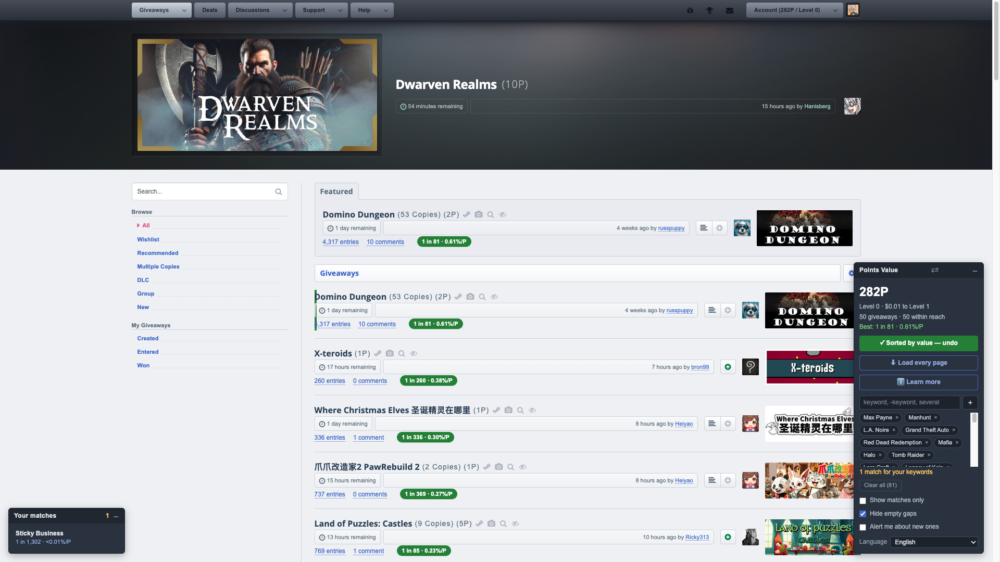
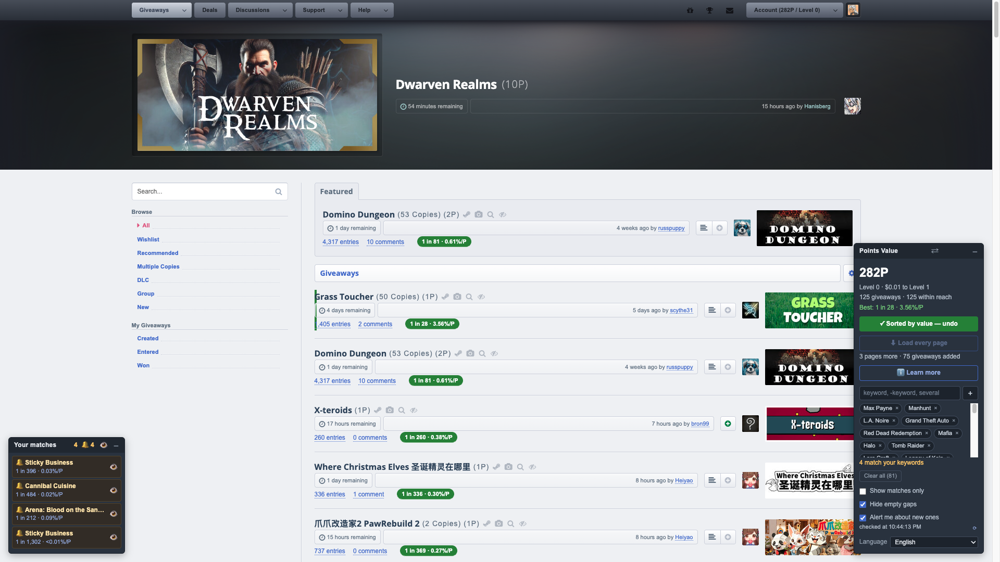
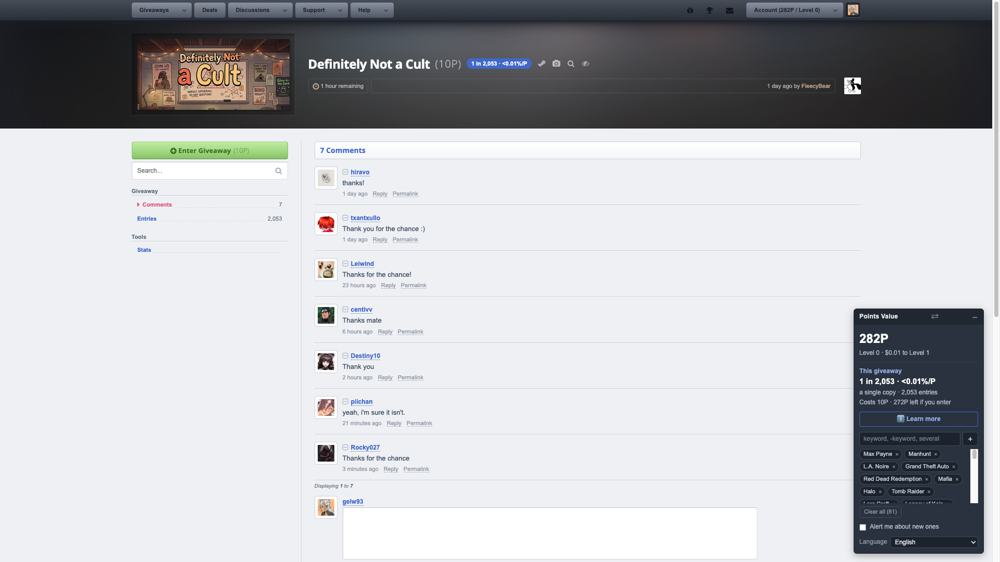
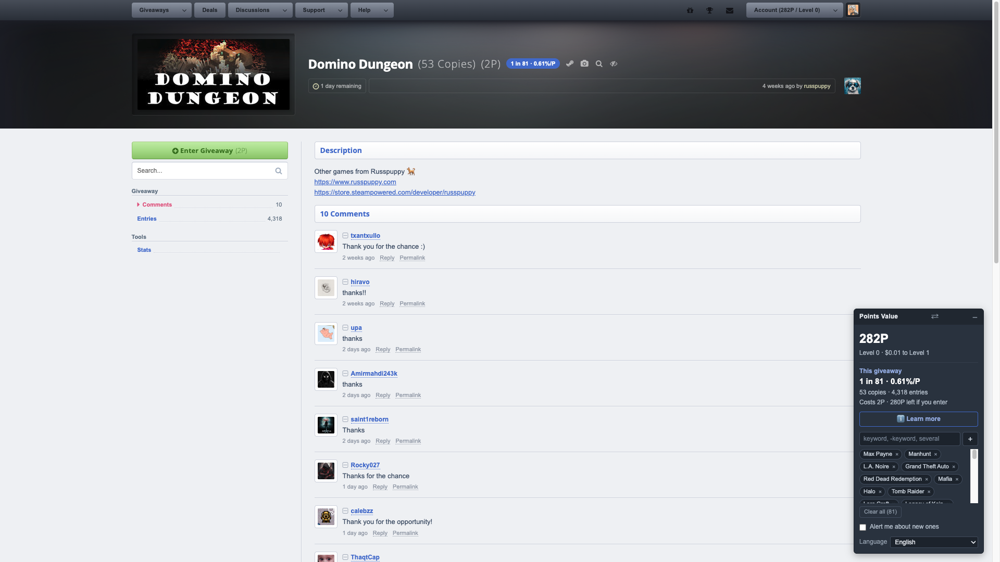

# SteamGifts Points Value

Tampermonkey userscript that works out the real odds of every SteamGifts giveaway and what they cost you in points. / Userscript de Tampermonkey que calcula la probabilidad real de cada sorteo de SteamGifts y lo que te cuesta en puntos.

*The listing: odds and value per point on every row, sorted best-first, the widget with your balance, your level, what is within reach, your keywords and the three checkboxes, and on the opposite side the panel listing your matches — click one and it jumps to its row. Both fold to their header. / El listado: probabilidad y valor por punto en cada fila, ordenado de mejor a peor, el widget con tu saldo, tu nivel, lo que te alcanza, tus palabras clave y las tres casillas, y al otro lado el panel que lista tus coincidencias —pulsa una y salta a su fila—. Los dos se pliegan a su cabecera.*

*The same page with the alerts on: the pass pulled three more pages into it —125 giveaways— and flagged the four that match, each with a 🔔 in the panel and an eye that marks it as seen, and the widget says when it last checked. Nothing is removed: tick "show matches only" and the rest of the rows just stop being painted. / La misma página con los avisos puestos: la revisión trajo tres páginas más —125 sorteos— y marcó los cuatro que casan, cada uno con su 🔔 en el panel y su ojo para darlo por visto, y el widget dice cuándo revisó por última vez. No se quita nada: marca «mostrar solo coincidencias» y las demás filas solo dejan de pintarse.*

*Inside a giveaway: the same two numbers next to its title and in the widget, plus what your balance is left at if you enter. These two are the whole point of the script — 2,053 entries against 4,318 make the first one look like the safer bet, but that one is a single copy at 10P and the other 53 copies at 2P, which is 1 in 2,053 versus 1 in 81, and under 0.01%/P versus 0.61%/P: the emptier giveaway is the worse one, and it costs five times as much. / Dentro de un sorteo: los dos mismos números junto a su título y en el widget, además de en cuánto queda tu saldo si entras. Estas dos son el script entero en una imagen —2.053 entradas parecen mejor apuesta que 4.318, pero ese es de copia única a 10P y el otro de 53 copias a 2P, o sea 1 de 2.053 contra 1 de 81, y menos de 0,01 %/P contra 0,61 %/P: el menos concurrido es el peor, y encima cuesta cinco veces más—.*

## English

### What it does

SteamGifts shows you how many people entered a giveaway, but never how likely you are to win it. A giveaway with **100 copies and 1,501 entries** and one with **1 copy and 1,020 entries** look the same on the listing, and they are not: the first is 1 in 15, the second 1 in 1,020. This script does that arithmetic for you, on every row:

- **Real odds** — copies divided by entries, written as `1 in 15`. Copies are the number that matters and the listing only prints them when there is more than one, so a row without that label is a single copy.
- **Value per point** — those odds against what the giveaway costs, as `0.44%/P`: how much of a chance each point buys. This is the number that tells you where a 400-point balance is worth spending, and no page on the site shows it.
- **Sort by value** — one button reorders the listing best-first. Press it again for the site's own order; the choice is remembered. The ones your level cannot reach go to the end whatever their value — the order answers where your balance is worth spending, and there it cannot be spent. Featured giveaways stay in their own section, untouched.
- **A widget** — your points balance in a size you can actually read, warning you in amber when you are sitting at the 400P cap and every point handed out is being lost; your level and what it would take to reach the next one; how many giveaways are within reach; the best value on the page; the sort button; and the language picker. It sits in a corner, and one button in its header moves it to the other side — being fixed, it covers a column of the listing, and which column is free depends on how wide your window is.
- **Every page in one** — a button pulls the pages after the one you are on into it, keeping whatever search and filters the address bar already has, so a whole search can be read, ranked and sorted at once instead of thirteen rows at a time. It works on any listing with more pages — the front page, a search, your wishlist, a game's own page — because the script goes by whether the page prints giveaway rows, not by a list of addresses. One request per page and 0.7s apart, up to 20 pages, with the page it is asking for on the button and stoppable at any point. The colour ranking then compares everything loaded, which is the point: the best quarter of one page is not the best quarter of twenty. The site's own pagination stops being right the moment a row is added, so its "Displaying 1 to 50" line goes away — but its page links stay while there are still pages to fetch, because that is what you would use if you stopped the load half-way.
- **Keywords** — type a franchise, a studio, anything you are waiting for, several at once separated by commas, and every giveaway whose name contains one gets an amber frame. A keyword written `-like this` is negative and wins over the positives, so `yakuza, -kiwami` marks the series except that one. Each keyword is also a link that searches the site for it, which beats typing it into the search box again, and a single button clears the whole list once it grows. With a long list, a checkbox switches to **matches only**: the rest of the rows stop being painted, which is the difference between a list of five franchises and a list of eighty. It is a view, not a filter — nothing is removed, untick it and everything is back — and it cuts by your own keywords, which the site knows nothing about.
- **A panel that lists your matches, and your alerts** — on the side opposite the widget, with each entry's odds and value. Click one and it jumps to its row on the page, marks it and leaves the keyboard focus on its title; it never opens the giveaway, because for that you would click the row itself as you always do. This is what makes twenty loaded pages usable: three of a thousand rows are yours, and you get to them in one click instead of scrolling for the amber frame. What the alerts turned up shares this same panel —there is no second one— and comes first, each with a 🔔 and an eye that marks it as seen right there. An alert whose giveaway is not on this page still gets listed, but stays inert instead of pretending it can be clicked. It folds to its header like the widget does, and folded it still shows both counts — how many matched and how many are new, which is the one thing you want at a glance when the list is long enough to be in the way.
- **Alerts for the ones you are waiting for** — a checkbox turns your keywords into a watch. It reads the whole giveaway listing, page by page, and flags every giveaway matching them in that panel, with a count and a beep every 5 seconds until you mark it as seen; what you marked never alerts again, so the same game cannot wake you twice. It does that pass every 15 minutes **and on every page of the site you open**, so a listing you have just landed on arrives already complete and already checked. Those page-load passes read the whole listing whatever the clock says, and they do not reset it: the 15-minute loop counts from its own last pass, so it fires on time however much you reload. Ticking or unticking the box clears the alerts and checks straight away, so switching it on tells you what is there right now. It works on whatever page of SteamGifts you have open —the forum included, which is where you would not notice on your own— and, since it has read those pages anyway, it leaves them loaded in the listing when you are on the front page with nothing searched or filtered: the load button's job, done for free. On a search it deliberately leaves the page alone, because dropping the general listing into your search would quietly turn it into a different search. Only one tab does the asking, however many you have open, and it goes one page at a time with a pause. There are no desktop notifications on purpose: the alert lives in the tab, because asking for notification permission is one of the few things a userscript does that you cannot undo from the page. The sound is Steam's own achievement chime.
- **Inside a giveaway** — open one and the same two numbers show up next to its title and in the widget, along with what your balance is left at if you enter, or how many points you are still missing, and a note when you are already in. If the entry count changes while you are on the page, the numbers follow it. That badge carries no ranking colour on purpose: with one giveaway on the page there is nothing to rank it against.

Details worth knowing:

- **It repeats none of the site's filtering**, and it assumes a setup. Hiding giveaways above your level, games you already own, DLC without the base game, ones you have already entered or games you filtered by hand is done by SteamGifts itself, server-side, in *Account → Settings → Giveaways* — faster and better than any script could. **Set 2, 3, 4, 5 and 6 to Yes**, leave 1 on *All* and 7 to taste. Without that, half the listing can be giveaways you cannot enter, they dilute the colour ranking, and rows your level cannot reach show up dimmed instead of not showing up at all.
- **A giveaway with no entries yet reads as certain**, not as a division by zero: the next entry takes a copy.
- **Values below 0.01% show as `<0.01`** rather than rounding down to a `0` that would be indistinguishable from a giveaway that costs nothing.
- **Sorting is manual.** The script does not reorder anything until you ask it to, so the page you land on is the page the site meant to give you.
- **Empty gaps, off by default.** SteamGifts slots its own bundle banners between the rows, one every thirteen or so. If a blocker empties one, the container keeps its reserved height and leaves a ~200px hole in the middle of the listing — that hole is the site's, not this script's. A checkbox in the widget folds away **only** the blocks showing nothing at all: a banner that does load is left alone, and one that loads late comes straight back. Those blocks are found by what they contain — the bundle banner or the ad slot — and not by the container's class, which is obfuscated and changes on every load, so nothing else in the listing is ever touched.

**Language:** English and Spanish only — the site itself exists in one language, so there is no point going further. Picked from your browser's languages, and overridable from the widget. SteamGifts pins `<html lang="en">` for everyone because its interface only exists in English, so the document's own language would be useless here.

**Install:**
1. Install [Tampermonkey](https://www.tampermonkey.net/).
2. Open the installer: [steamgifts-points-value.user.js](https://github.com/g31w0fw0rld/steamgifts-points-value/raw/main/steamgifts-points-value.user.js) (also on [GreasyFork](https://greasyfork.org/es-419/users/1590477-g31w) and [OpenUserJS](https://openuserjs.org/users/g31w0fw0rldgmail.com/scripts)).

**Sites:** `www.steamgifts.com/*`

## Español

### Qué hace

SteamGifts te dice cuánta gente entró en un sorteo, pero nunca qué probabilidad tienes de ganarlo. Un sorteo con **100 copias y 1.501 entradas** y otro con **1 copia y 1.020 entradas** se ven igual en el listado, y no lo son: el primero es 1 de 15 y el segundo 1 de 1.020. El script hace esa cuenta por ti, en cada fila:

- **Probabilidad real** —copias entre entradas, escrito como `1 de 15`—. Las copias son el número que importa y el listado solo las imprime cuando hay más de una, así que una fila sin esa etiqueta es de copia única.
- **Valor por punto** —esa probabilidad frente a lo que cuesta el sorteo, como `0,44 %/P`: cuánta posibilidad compra cada punto—. Es el número que dice dónde conviene gastar un saldo de 400 puntos, y no aparece en ninguna página del sitio.
- **Ordenar por valor** —un botón reordena el listado de mejor a peor; púlsalo otra vez para volver al orden del sitio, y la preferencia se recuerda—. Los que tu nivel no alcanza van al final valgan lo que valgan: el orden contesta a dónde conviene gastar el saldo, y ahí no se puede gastar. Los sorteos destacados se quedan en su propia sección, sin tocar.
- **Un widget** —tu saldo de puntos en un tamaño que se lee de un vistazo, en ámbar cuando estás en el tope de 400P y cada punto repartido se está perdiendo; tu nivel y lo que falta para el siguiente; a cuántos sorteos te alcanza; el mejor valor de la página; el botón de ordenar; y el selector de idioma—. Vive en una esquina, y un botón de su cabecera lo pasa al otro lado: al estar fijo tapa una columna del listado, y cuál queda libre depende de lo ancha que tengas la ventana.
- **Todas las páginas en una** —un botón trae a la página en la que estás las siguientes, respetando la búsqueda y los filtros que ya tenga la barra de direcciones, para poder leer, valorar y ordenar una búsqueda entera de una vez en vez de de trece filas en trece—. Funciona en cualquier listado con más páginas —la portada, una búsqueda, tu lista de deseados, la página de un juego— porque el script se guía por si la página imprime filas de sorteo, no por una lista de direcciones. Una petición por página y cada 0,7 s, hasta 20 páginas, con la página que está pidiendo escrita en el botón y con parada en cualquier momento. El reparto de colores pasa entonces a comparar todo lo cargado, que es de lo que se trata: el mejor cuarto de una página no es el mejor cuarto de veinte. La paginación del sitio deja de ser cierta en cuanto entra una fila, así que su «Displaying 1 to 50» se oculta —pero sus enlaces de página se quedan mientras queden páginas por traer, porque son justo lo que usarías si paraste la carga a medias—.
- **Palabras clave** —escribe una saga, un estudio, cualquier cosa que estés esperando, varias de golpe separadas por comas, y cada sorteo cuyo nombre contenga alguna queda con un marco ámbar—. Una palabra escrita `-así` es negativa y manda sobre las positivas, así que `yakuza, -kiwami` marca la saga menos ese. Cada palabra es además un enlace que la busca en el sitio, que es más rápido que volver a teclearla en el buscador, y un botón vacía la lista entera cuando se hace larga. Con una lista larga, una casilla pasa a **mostrar solo coincidencias**: el resto de filas deja de pintarse, que es la diferencia entre una lista de cinco sagas y una de ochenta. Es una vista, no un filtro —no quita nada, se desmarca y vuelve todo— y recorta por tus palabras, que el sitio no conoce.
- **Un panel que lista tus coincidencias, y tus avisos** —al lado contrario del widget, con la probabilidad y el valor de cada entrada—. Pulsa una y salta a su fila en la página, la marca y deja el foco del teclado en su título; nunca abre el sorteo, porque para eso pulsarías la fila misma, como haces siempre. Es lo que hace usables veinte páginas cargadas: tres filas de mil son tuyas, y llegas a ellas con un clic en vez de bajar buscando el marco ámbar. Lo que encuentran los avisos comparte este mismo panel —no hay un segundo— y va primero, cada uno con su 🔔 y su ojo para darlo por visto ahí mismo. Un aviso cuyo sorteo no está en esta página también se lista, pero se queda quieto en vez de fingir que se puede pulsar. Se pliega a su cabecera como el widget, y plegado sigue diciendo las dos cuentas —cuántas coincidieron y cuántas son nuevas—, que es lo único que quieres de un vistazo cuando la lista es lo bastante larga para estorbar.
- **Avisos de los que estás esperando** —una casilla convierte tus palabras clave en una guardia—. Lee el listado de sorteos entero, página por página, y marca en ese panel cada sorteo que casa, con su cuenta y un pitido cada 5 segundos hasta que lo marques como visto; lo marcado no vuelve a avisar nunca, así que el mismo juego no puede despertarte dos veces. Esa pasada la hace cada 15 minutos **y en cada página del sitio que abres**, así que un listado al que acabas de llegar te llega ya completo y ya revisado. Las pasadas de la carga leen el listado entero diga lo que diga el reloj, y no lo reinician: los 15 minutos cuentan desde la última pasada del propio bucle, así que llega a su hora aunque recargues sin parar. Marcar o desmarcar la casilla borra los avisos y revisa al momento, así que encenderla te dice qué hay ahora mismo. Funciona en cualquier página de SteamGifts que tengas abierta —el foro incluido, que es justo donde no te enterarías por tu cuenta— y, como esas páginas ya las ha leído, las deja cargadas en el listado cuando estás en la portada sin nada buscado ni filtrado: el trabajo del botón de cargar, gratis. En una búsqueda no toca la página a propósito, porque meterle el listado general convertiría tu búsqueda en otra sin decírtelo. Solo una pestaña pregunta, tengas las que tengas abiertas, y va de página en página con pausa. No hay notificaciones del escritorio a propósito: el aviso vive en la pestaña, porque pedir permiso de notificaciones es de las pocas cosas que un userscript hace que no puedes deshacer desde la página. El sonido es la campanita de logro desbloqueado de Steam.
- **Dentro de un sorteo** —abre uno y los dos mismos números aparecen junto a su título y en el widget, además de en cuánto queda tu saldo si entras, o cuántos puntos te faltan, y un aviso si ya estás dentro—. Si el número de entradas cambia mientras estás en la página, los números lo siguen. Esa píldora no lleva color de rango a propósito: con un solo sorteo en la página no hay con qué compararlo.

Detalles que conviene saber:

- **No repite ningún filtro del sitio**, y da por supuesta una configuración. Ocultar los sorteos por encima de tu nivel, los juegos que ya tienes, los DLC sin el juego base, aquellos en los que ya entraste o los juegos que filtraste a mano lo hace el propio SteamGifts, del lado del servidor, en *Account → Settings → Giveaways*, más rápido y mejor de lo que podría cualquier script. **Pon el 2, el 3, el 4, el 5 y el 6 en Yes**, deja el 1 en *All* y el 7 a tu gusto. Sin eso, media página pueden ser sorteos en los que no puedes entrar, diluyen el reparto de colores, y las filas que tu nivel no alcanza aparecen en gris en vez de no aparecer.
- **Un sorteo sin entradas todavía se lee como seguro**, no como una división por cero: la siguiente entrada se lleva una copia.
- **Los valores por debajo del 0,01 % se muestran como `<0,01`** en vez de redondearse a un `0` que no se distinguiría de un sorteo que no cuesta puntos.
- **La ordenación es manual.** El script no mueve nada hasta que se lo pides, así que la página que abres es la que el sitio quiso darte.
- **Huecos vacíos, apagado por defecto.** SteamGifts intercala entre las filas sus propios banners de bundles, uno cada trece más o menos. Si un bloqueador vacía alguno, el contenedor conserva la altura reservada y deja un hueco de unos 200 px en mitad del listado —ese hueco es del sitio, no de este script—. Una casilla del widget pliega **solo** los bloques que no muestran absolutamente nada: un banner que sí carga se queda como está, y uno que carga tarde vuelve solo. Esos bloques se reconocen por lo que llevan dentro —el banner de bundle o el hueco de anuncio— y no por la clase del contenedor, que es ofuscada y cambia en cada carga, así que no se toca nada más del listado.

**Idioma:** solo inglés y español —el propio sitio existe en un solo idioma, así que no tiene sentido ir más allá—. Se elige por los idiomas de tu navegador y se puede forzar desde el widget. SteamGifts fija `<html lang="en">` para todo el mundo porque su interfaz solo existe en inglés, así que el idioma del documento no serviría de nada aquí.

**Instalación:**
1. Instala [Tampermonkey](https://www.tampermonkey.net/).
2. Abre el instalador: [steamgifts-points-value.user.js](https://github.com/g31w0fw0rld/steamgifts-points-value/raw/main/steamgifts-points-value.user.js) (también en [GreasyFork](https://greasyfork.org/es-419/users/1590477-g31w) y [OpenUserJS](https://openuserjs.org/users/g31w0fw0rldgmail.com/scripts)).

**Sitios:** `www.steamgifts.com/*`

## Privacy / Privacidad

**EN:** the script sends nothing to third parties or to the author. Everything it shows on a page is arithmetic on what that page already printed: copies, entries, point cost, the level column and, on a giveaway page, its own header and entry counter. **Two things go to the network, and both only to SteamGifts itself** — same origin, with your session, exactly as clicking a link on the site would, and nothing about either is sent anywhere else. *Load every page* asks for the pages after the one you are on, and only when you press it. *Alerts*, if you tick them, read the whole listing every 15 minutes and on every page of the site you open: one request per page, 0.7s apart, up to 20 pages, and only from one tab however many you have open. Leave both alone and no request leaves your browser. It declares `@grant none`, so it has no access to the userscript manager's privileged APIs. The only things it stores are your list of keywords, the language you picked and how you left the page —sorted by value or not, matches only or not, empty gaps folded or not, which side the widget sits on, and whether the widget and the matches panel are folded—, plus, with the alerts on, the list of giveaways it has alerted you about and which ones you marked as seen: that list is what stops the same game from alerting twice. All of it kept in `localStorage` on your own machine. It reads your points balance from the site's own header to tell you what you can afford, and that number never leaves the page.

**ES:** el script no envía nada a terceros ni al autor. Todo lo que muestra en una página son cuentas sobre lo que esa página ya había impreso: copias, entradas, coste en puntos, la columna de nivel y, en la página de un sorteo, su propia cabecera y su contador de entradas. **Dos cosas salen a la red, y las dos solo a SteamGifts** —al mismo dominio, con tu sesión, igual que si pulsaras un enlace del propio sitio—, y de ninguna se manda nada a otra parte. *Cargar todas las páginas* pide las páginas siguientes a la que estás, y solo cuando la pulsas. Los *avisos*, si los marcas, leen el listado entero cada 15 minutos y en cada página del sitio que abres: una petición por página, cada 0,7 s, hasta 20 páginas, y solo desde una pestaña tengas las que tengas abiertas. Sin tocar ninguna de las dos, no sale ninguna petición de tu navegador. Declara `@grant none`, así que no tiene acceso a las APIs privilegiadas del gestor de userscripts. Lo único que guarda son tus palabras clave, el idioma que elegiste y cómo dejaste la página —ordenada por valor o no, solo coincidencias o no, huecos vacíos plegados o no, de qué lado está el widget, y si el widget y el panel de coincidencias están plegados—, y con los avisos puestos, la lista de sorteos de los que te avisó y cuáles marcaste como vistos: esa lista es lo que evita que el mismo juego avise dos veces. Todo en el `localStorage` de tu propia máquina. Lee tu saldo de puntos de la cabecera del propio sitio para decirte a cuánto te alcanza, y ese número no sale de la página.

## Support / Apoyar

This is part of something I'm building to grow. If it helps you and you'd like to support it, you can tip me on **[Ko-fi](https://ko-fi.com/g31w0fw0rld)** —only if you want—; and if a cause needs it more than I do, help that one instead.

Esto es parte de algo que estoy construyendo para crecer. Si te sirve y quieres apoyar, puedes invitarme un café en **[Ko-fi](https://ko-fi.com/g31w0fw0rld)** —solo si quieres—; y si hay una causa que lo necesite más que yo, ayúdala a ella.

---
Author / Autor: **g31w0fw0rld** · License / Licencia: **MIT**
